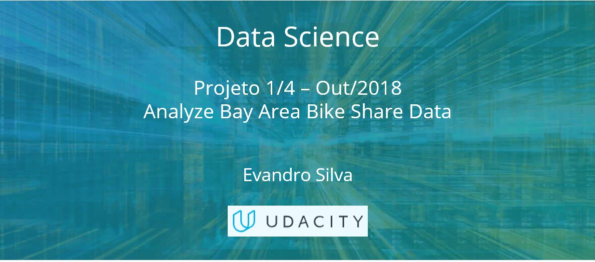

### Nanodegree - Fundamentos de AI & Machine Learning - Projeto 1 de 1 (UDACITY)

#### Projeto/Necessidade de negócio: 
- -->Falta incluir >Def_Proj - Identificar fraude no Email da Enron.pdf

#### Entrega: 
- Report - boston_housing_PT.hmtl
- boston_housing_PT.ipynb

#### Avaliação do cliente:
 - Udacity - Review 20181025.pdf 
